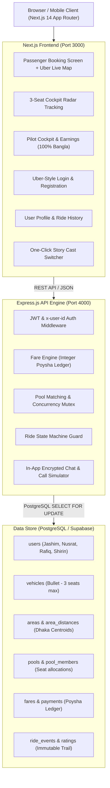
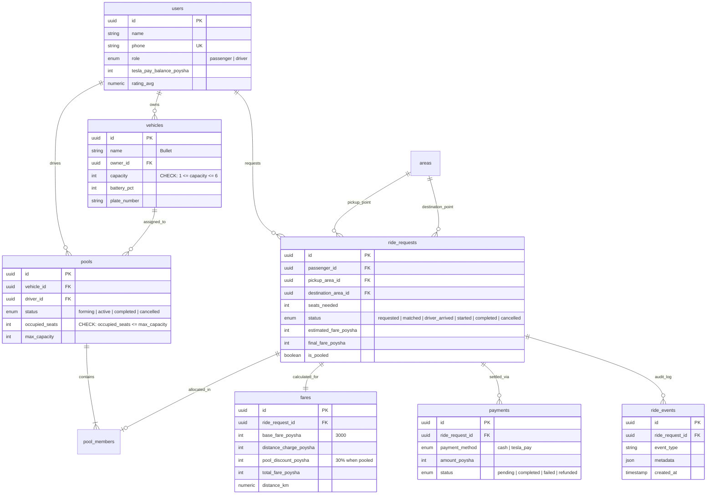

# Oi Tesla (ওই টেসলা) — Dhaka Electric Micro-Pool MVP

> **Share a seat. Split the fare. Survive Dhaka traffic.**  
> *Production-minded micro-mobility ride-pooling platform built for Banani, Gulshan, and Mohakhali.*
> *Demonstration of the project: [](https://www.loom.com/share/0df8fb0e447b4f529b1e2be2b1c44a53)*

[](./oi-tesla/backend)
[](./docker-compose.yml)
[](https://nodejs.org)
[](https://nextjs.org)
[](https://supabase.com)
[](https://www.typescriptlang.org)

---

## 1. Executive Summary & Problem Statement

Dhaka's traffic is notoriously congested, where hailing a solo rickshaw or CNG often leads to exorbitant fares and choked roads along key business corridors like **Banani Road 11**, **Gulshan 1**, and **Mohakhali Wireless Gate**.

**Oi Tesla** introduces a high-frequency, shared electric transit model powered by battery-operated 3-seater electric trikes colloquially dubbed **"Teslas"** (*"ওই টেসলা!"*).

### The Story Cast (PRD Section 1)
- **The Driver**: **Jashim Uddin (Pilot Jashim)** operates **Bullet**, his 3-seat, battery-powered Tesla e-rickshaw (plate: `DH-Metro-TH-14-8821`).
- **The Passengers**:
  - **Nusrat Jahan** needs to commute from **Banani Road 11** to **Mohakhali Wireless Gate** (3.2 km).
  - **Rafiq Ahmed** travels along an overlapping route from **Banani** to **Gulshan 1** (2.0 km).
  - **Shirin Akter** attempts to grab the 3rd and final seat shortly after.
- **The Engineering Problem**:
  - Calculate fair, transparent, hand-verifiable split fares using integer poysha arithmetic.
  - Concurrency control: prevent race conditions when multiple riders compete for Bullet's last remaining seat.
  - State machine lifecycle integrity: `REQUESTED → MATCHED → DRIVER_ARRIVED → STARTED → COMPLETED`.
  - Privacy and authorization isolation: passengers only see their own fare and status.
  - Authentic localization: 100% Bangla enforcement for rickshaw drivers and dynamic bilingual support (`EN | বাং`) for passengers.

---

## 2. System Architecture



---

## 3. Database ERD (Entity Relationship Diagram)



---

## 4. Hand-Verifiable Fare Model (PRD Section 5)

### Pricing Formula
$$\text{Passenger Fare} = \text{Base Fare} + \text{Distance Charge} - \text{Pool Discount}$$

All monetary computations are stored as **integer poysha** ($1\text{ BDT} = 100\text{ poysha}$) to eliminate floating-point representation bugs ($0.1 + 0.2 \neq 0.3$).

| Parameter | Value | Poysha |
|---|---|---|
| **Base Fare** | ৳30.00 | `3000` |
| **Per-Kilometer Rate** | ৳10.00 / km | `1000` / km |
| **Pool Discount** | 30% discount | `subtotal * 0.30` |

### Hand Calculation Examples (from the Story Cast)

#### 1. Nusrat: Banani → Mohakhali (3.2 km, Pooled)
- $\text{Base Fare} = 3000\text{ poysha}$ (৳30.00)
- $\text{Distance Charge} = \text{round}(3.2 \times 1000) = 3200\text{ poysha}$ (৳32.00)
- $\text{Subtotal} = 3000 + 3200 = 6200\text{ poysha}$
- $\text{Pool Discount} = 30\% \times 6200 = 1860\text{ poysha}$ (৳18.60 savings)
- **Total Fare** = $6200 - 1860 = \mathbf{4340\text{ poysha}}\ (\mathbf{\text{৳}43.40})$

#### 2. Rafiq: Banani → Gulshan 1 (2.0 km, Pooled)
- $\text{Base Fare} = 3000\text{ poysha}$ (৳30.00)
- $\text{Distance Charge} = \text{round}(2.0 \times 1000) = 2000\text{ poysha}$ (৳20.00)
- $\text{Subtotal} = 3000 + 2000 = 5000\text{ poysha}$
- $\text{Pool Discount} = 30\% \times 5000 = 1500\text{ poysha}$ (৳15.00 savings)
- **Total Fare** = $5000 - 1500 = \mathbf{3500\text{ poysha}}\ (\mathbf{\text{৳}35.00})$

---

## 5. Concurrency & Race Condition Solution (PRD Section 12)

### The Problem
Bullet has **3 seats maximum**. Suppose **Rafiq** already occupies 2 seats. Exactly **1 seat remains**.  
**Nusrat** and **Shirin** both see 1 seat available and click "Confirm" at the exact same millisecond.

### The Solution
1. **Database Level**: `SELECT ... FOR UPDATE` locks the pool row inside a transaction.
2. **Constraint Enforcement**: PostgreSQL check constraint `CHECK (occupied_seats <= max_capacity)` provides an impenetrable boundary.
3. **Application Level**: Mutex queue serialization (`claimPoolSeat`) ensures that requests are serialized into turns. The first request increments `occupied_seats = 3` and commits. The second request immediately fails with:
   ```json
   { "success": false, "error": "Capacity exceeded! Requested: 1, Available: 0" }
   ```
4. **Verification**: Validated by automated concurrent test `tests/concurrency.test.ts` firing simultaneous `Promise.allSettled` requests.

---

## 6. Key Features & User Experience

### A. Uber-Style Live Map with Authentic Dhaka Rickshaws
- **Uber Dark Mode Aesthetic**: Powered by Leaflet with CartoDB Dark Matter tiles.
- **Custom Rickshaw Markers**: Custom **Dhaka 3-wheeled Electric Auto-Rickshaw SVG markers** cruising along the neon route polyline with an animated radar pulse.
- **Corridor Hubs**: Real Dhaka transit centroids (Banani Road 11 ↔ Mohakhali ↔ Gulshan 1 ↔ Dhanmondi 27).

### B. Ubiquitous Tesla "T" Branding
- Official vector geometry of the iconic Tesla "T" emblem.
- Displayed across the **Navbar**, **Map Markers**, **Booking Cards**, **Driver Cockpits**, and **TeslaPay Wallet**.

### C. Bilingual Bangla (`বাংলা`) & English with Driver Auto-Bangla Enforcement
- Comprehensive English ↔ Bengali translation dictionary with Google Font **Hind Siliguri**.
- **Driver Rule Enforcement**: Whenever the active user is a driver (Pilot Jashim) or navigating driver cockpit routes (`/driver`, `/driver/earnings`), the UI **automatically and strictly locks into Bangla**.

### D. In-App Encrypted Chat & Privacy-Masked Calling
- **Encrypted Pilot Chat Drawer**: Slide-up modal with dynamic typing indicators and quick Dhaka transit chips (*"আমি বনানী ১১ গেটে আছি 📍"*, *"গাড়ির রঙ কী? 🛺"*).
- **Masked VoIP Dialer**: Phone modal displaying masked pilot numbers to protect passenger privacy.

### E. User Profile & Account Management (`/profile`)
- Instant editable **Full Name** and **Mobile Number** (`+880...`) with duplicate phone validation.
- Personal trip history logs with route points, seats, poysha fare breakdown, and status tags.

---

## 7. Demo Story Cast & Credentials

No generic placeholders. Use the one-click switcher in the top bar or test with these credentials:

| Actor | Character | Role | Vehicle / Route | Phone | Balance |
|---|---|---|---|---|---|
| **Driver** | **Jashim Uddin** | `driver` | **Bullet** (3-seat EV) | `+8801912345678` | ৳5,000.00 |
| **Passenger 1** | **Nusrat Jahan** | `passenger` | Banani → Mohakhali (3.2 km) | `+8801712892401` | ৳420.00 |
| **Passenger 2** | **Rafiq Ahmed** | `passenger` | Banani → Gulshan 1 (2.0 km) | `+8801812345678` | ৳350.00 |
| **Passenger 3** | **Shirin Akter** | `passenger` | Banani → Mohakhali (3rd seat) | `+8801612345678` | ৳280.00 |

---

## 8. Quickstart & Installation

### Option A: Docker Compose (One Command)

From the project root:
```bash
docker compose up --build
```

This automatically spins up:
- **PostgreSQL 16** container on port `5432` with pre-executed migrations and seed data.
- **Express Backend** container on port `4000` with active healthcheck.
- **Next.js Frontend** container on port `3000` with production bundle.

---

### Option B: Local Development

```bash
# 1. Start Backend (Terminal 1)
cd oi-tesla/backend
npm install
npm run dev

# 2. Start Frontend (Terminal 2)
cd oi-tesla/frontend
npm install
npm run dev
```

Visit **`http://localhost:3000`** in your browser.

---

## 9. Running the Test Suite

Run the 23 comprehensive domain and concurrency tests:

```bash
cd oi-tesla/backend
npm test
```

### Test Suite Output:
- `tests/fare.test.ts` (4 passed): Verifies integer poysha arithmetic, Nusrat ৳43.40, Rafiq ৳35.00, solo vs pool.
- `tests/capacity.test.ts` (2 passed): Strict validation that Bullet never exceeds 3 seats.
- `tests/stateTransition.test.ts` (5 passed): Progressive lifecycle checks, terminal status protection.
- `tests/concurrency.test.ts` (2 passed): Race condition simulation with simultaneous seat claims.
- `tests/cancellation.test.ts` (3 passed): Cancellation seat liberation and fee rules.
- `tests/authorization.test.ts` (4 passed): Privacy isolation preventing riders from accessing others' data.
- `tests/profile.test.ts` (3 passed): Profile mutations, name/phone updates, and duplicate validation.

---

## 10. Technology Choices & Justification (PRD Section 7)

| Layer | Chosen Tool | Considered Alternative | Justification | When We Would Switch |
|---|---|---|---|---|
| **Frontend** | **Next.js 14 (App Router)** | Plain React (Vite) | SSR speed, zero-config routing, mobile-optimized asset loading. | If mobile native performance requires React Native / Flutter. |
| **Backend** | **Express.js + TypeScript** | NestJS / Fastify | Minimal overhead, explicit middleware control, zero magic for concurrency locks. | If microservices / gRPC modularity becomes necessary at scale. |
| **Database** | **PostgreSQL (Supabase)** | MongoDB / MySQL | Strict relational constraints, row-level locks (`SELECT FOR UPDATE`), ACID guarantees. | If unstructured sensor streams dominate, offload telemetry to ClickHouse. |
| **Monetary Type** | **Integer Poysha** | Decimal / Float | Eliminates binary floating point rounding inaccuracies completely. | Never. Financial systems must always use integer minimal subunits. |
| **Styling** | **Tailwind CSS (Stitch Tokens)** | Styled Components | Atomic design token fidelity, high-contrast dark cyberpunk palette. | If design system transitions to native platform components. |

---

## 11. AI Usage Policy Transparency (PRD Section 8)

- **Tools Used**: Antigravity IDE, Claude 3.5 Sonnet, Gemini Flash.
- **Primary Use**:
  - Drafting initial PostgreSQL schema and DDL statements.
  - Generating responsive Tailwind CSS layout tokens from Stitch UI design mockups.
- **Accepted AI Suggestion**:
  - Storing fares in **integer poysha** (100 poysha = 1 BDT) to prevent currency float drift.
- **Rejected/Modified AI Suggestion**:
  - The AI initially suggested using client-side polling for vehicle capacity checks. **Rejected** because client-side checks fail under concurrent race conditions. Instead, implemented database row-level locking (`SELECT ... FOR UPDATE`) and server-side mutex queue serialization.

---

## 12. Bonus: "If Oi Tesla Goes Viral" (1M Passengers, 100k Drivers)

```
[Edge CDN / Cloudflare DDoS & WAF]
            │
            ▼
[Layer 7 Load Balancer: NGINX / AWS ALB]
            │
    ┌───────┴───────┐
    ▼               ▼
[API Node 1]   [API Node 2] ... [API Node N] (Horizontal Autoscaling)
    │               │
    ├── Redis Cluster (Geospatial GEOSEARCH, Distributed Redlock, Token Bucket Rate Limiting)
    ├── Apache Kafka / RabbitMQ (Event Stream: RideRequested, DriverMatched, TripCompleted)
    │
    ▼
[PostgreSQL Primary (Writes & Locks)]
    │── CDC (Debezium)
    ▼
[Read Replicas] + [ClickHouse Telemetry Warehouse]
```

1. **Geospatial Proximity**: Use Redis `GEOSEARCH` to index driver locations in sub-millisecond memory rather than polling Postgres spatial tables.
2. **Distributed Locking**: Upgrade single-node mutex to Redis **Redlock** for distributed seat allocation across auto-scaled container pods.
3. **Event-Driven Architecture**: Decouple trip events (notifications, receipts, driver payouts) using **Apache Kafka** event streaming.
4. **Database Scaling**: Read replicas for ride history and profiles; partition `ride_events` by month.

---

## 13. Six-Minute Demo Walkthrough Outline

- **0:00 - 1:00**: *The Dhaka Problem & Story*: Introduction to Jashim, Bullet, Nusrat, Rafiq, and the Banani micro-pool corridor.
- **1:00 - 3:00**: *Engineering Architecture*: Explaining the integer poysha model, state machine integrity, and concurrency serialization.
- **3:00 - 5:00**: *Product Tour*: Live demo of Nusrat booking from Banani to Mohakhali (৳43.40), Rafiq pooling to Gulshan 1 (৳35.00), Jashim accepting into Bullet's 3-seat cockpit, and Shirin experiencing capacity enforcement.
- **5:00 - 6:00**: *Edge Cases & Scale*: Cancellation seat release, race condition test suite, and viral scaling architecture.
